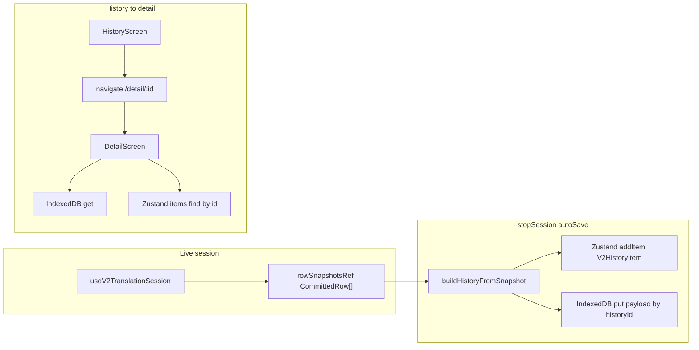

# V2 history detail — design spec

## Problem

`DetailScreen` uses hardcoded `TRANSCRIPT`, header, and filter chips. `HistoryScreen` navigates to `/detail` with no session key. Full lines exist only in memory during recording (`CommittedRow[]` in `use-v2-translation-session`); only `V2HistoryItem` metadata is persisted today.

## User stories

- As a user, I open History, tap a session, and see **that** session’s original + translated lines (not demo data).
- As a user, I use back navigation and still have the correct session if I opened it via `/detail/:id` (reload in WebView: same).
- As a user, when I delete sessions from History, their stored transcript body **does not** remain as orphan data.

## Decisions (locked)

| Topic | Choice |
|--------|--------|
| List vs body | **Hybrid:** metadata in Zustand `persist` (`v2-history`); full rows in **IndexedDB** |
| Body store | **IndexedDB** (no new Rust in v1 of feature) |
| Routing | **`/detail/:historyId`** (`useParams`) |
| Write timing | **Batch on `stopSession` only** (with `autoSave` path aligned with `addItem`) |

## Approaches considered

1. **All-in localStorage** — rejected (quota, large JSON parse on every hydrate).
2. **Files via Tauri** — deferred; IndexedDB chosen for fewer layers.
3. **Router state only** — rejected (reload loses target).

## Architecture



### Components

- **`v2-history-store`** — unchanged shape for list items; optional helper `getItem(id)` / selector (or inline in UI).
- **New module e.g. `v2/storage/transcript-idb.ts`** — `openDb`, `putTranscript(id, payload)`, `getTranscript(id)`, `deleteTranscripts(ids)`. Single object store `transcripts` key = `historyId`.
- **`use-v2-translation-session`** — on successful `buildHistoryFromSnapshot` + `addItem`, **await** `putTranscript(item.id, payload)` with same `id` as item. Payload includes at minimum `{ rows: CommittedRow[], sessionStartMs: number }` so detail can format relative times without guessing.
- **`routes.ts` / `AppShellV2`** — route `detail/:historyId` (or constant pattern); `DetailScreen` receives `historyId` from params.
- **`history-screen.tsx`** — `onSelectItem(id)` or navigate inline with `it.id` from row.
- **`detail-screen.tsx`** — load metadata from Zustand by `historyId`; load body from IDB; map `CommittedRow` → row UI (flags/lang from `ALL_AVAILABLE_LANGUAGES` like `scrape-transcript`); replace hardcoded chips with data-driven speakers from rows (rename modal stays **non-functional stub** unless separate spec).

### IDB payload (contract)

```ts
// versioned for future migrations
type StoredSessionTranscript = {
  v: 1;
  sessionStartMs: number;
  rows: CommittedRow[]; // existing type from scrape-transcript
};
```

- **Key:** `historyId` (string, same as `V2HistoryItem.id`).

## Data flow

1. **Save:** `stopSession` → flush DOM snapshot → `recording.stop()` → if `autoSave`: build item → `addItem(item)` → `putTranscript(item.id, { v:1, sessionStartMs, rows: copy })`. Use **copy** of rows array so later mutations do not affect stored snapshot.
2. **Open:** `navigate(\`/detail/${id}\`)` → `DetailScreen` reads `historyId` → `items.find` for header (date, time, flags, preview, dur, speakers) → `getTranscript(historyId)` for list body.
3. **Delete:** `removeItems(ids)` must call `deleteTranscripts(ids)` (same tick or immediately after store update) so IDB stays consistent.

## Error handling / edge cases

| Case | Behavior |
|------|----------|
| `historyId` missing in URL | Redirect to `ROUTES.HISTORY` or show empty error |
| Item in Zustand but IDB miss (failed write, manual DB clear) | Friendly “Transcript unavailable” + back; do not crash |
| IDB miss + no list item | Same as invalid id |
| `autoSave` off | No new items; detail only for past saved sessions |
| Very large `rows` | Accept for v1; IDB quota errors → catch, surface toast/log, optional: skip `addItem` if IDB fails **or** add item with flag `transcriptMissing` (prefer **transactional**: if IDB put fails after `addItem`, remove item from store + toast — pick one rule in impl and test) |
| Delete partial failure | Retry delete IDB; if still fail, log + leave orphan (document as known risk v1) |

**Transactional recommendation:** `putTranscript` **before** `addItem` risks orphan IDB without list entry; **after** risks list without body. Prefer **after** `addItem` with **rollback** `removeItems` if `putTranscript` throws so list and IDB stay aligned.

## Filter chips / speaker UI

- Derive unique speakers from `rows` (order of first appearance).
- “All” chip + one chip per speaker index or label; filter client-side list in memory (no extra IDB reads).

## Share / Export / Rename

- **Out of scope for v1** of this spec: wire buttons to no-op or keep disabled with tooltip later. Rename modal: keep UI shell or hide until spec’d.

## Testing strategy

- **Manual:** record short session → stop → open history → tap → lines match live session; delete session → reopen app → row + IDB gone (verify via devtools Application tab).
- **Unit (if/when test harness exists):** pure mappers `CommittedRow` → detail row props; IDB wrapper behind injectable interface for mock.

## Implementation risks

- IDB `onupgradeneeded` versioning must ship with first merge.
- Zustand `persist` rehydration async: `DetailScreen` may render before items hydrated — use store subscription or wait for `persist.hasHydrated()` (if available) or tolerate loading state until hydrated.

## Success criteria

- No hardcoded `TRANSCRIPT` in production path for saved sessions.
- Tapping two different history entries shows two different bodies.
- Deleting history removes IDB key for those ids (verified).

## Dependencies

- `react-router-dom` route param (already in app).
- No new npm dep required if using raw `idb` API; optional small `idb` package for ergonomics — **impl choice**.

## Next steps

1. Implement IDB module + delete hook-up.
2. Thread `historyId` route + navigation from `HistoryRow`.
3. Refactor `stopSession` save path for IDB + transactional rule above.
4. Rebuild `DetailScreen` from store + IDB with loading/error states.

---

*Spec version: 1. After approval, run `/plan` with this file as context.*
